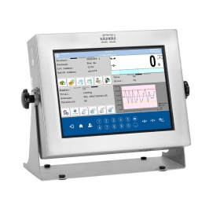
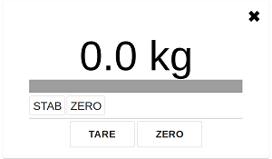

## Extended Web Interface


This application is an example of how a company can create its own program for the HY10 terminal. It enables basic data exchange via websocket (JSON, e.g. mass request, taring, zeroing.
The application can be a base for further development by adding new components and using additional commands presented in the JSON Database Interface for HY10 file.

  

Application based on REACT and nodejs.<br/>
</br>

### JSON Database Interface for HY10
The description file can be found here:
https://github.com/Radwag/EWI/blob/master/HY10%20JSON%20Data%20Exchange%20Interface.pdf

### App.js

Main application file: </br>

closeWindow() - function used to close the application (closes the browser)

### ProgresBar.js

runSocket() - function used to launch websocket on localhost at 4101 port

Every 250 milliseconds a mass query is sent via websocket

```{ COMMAND: 'GET_MASS' }```

and the following variables are updated:

``` 
Max - maximum capacity
NetAct.Value - current value
NetAct.Unit - current unit
NetCal.Value - calibration value
isStab - if stable
isTare - if tared
isZero - if zeroed
NetAct.Precision - current precision
```

tare() - function used to send tare command via websocket

```{ COMMAND: 'TARE' }```

zero() - function used to send zero command via websocket

```{ COMMAND: 'ZERO' }```


## Production version

To prepare production version, run the following command:

```npm run build```

### start.js

File starting the application in production mode

```node start.js```

